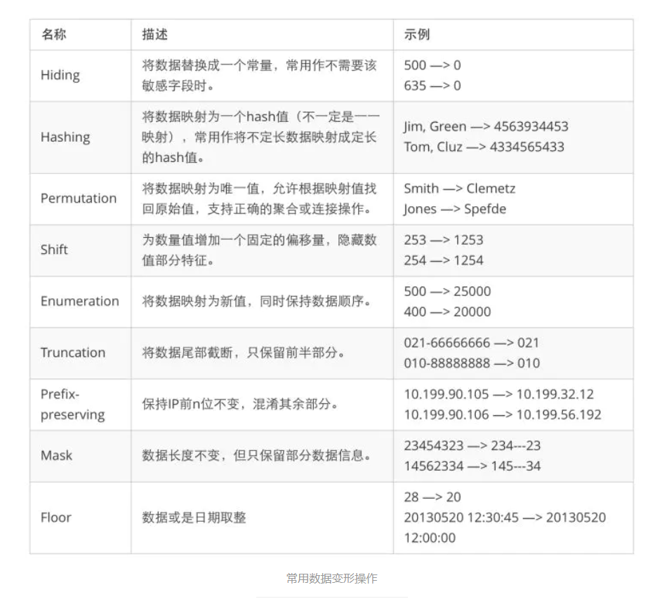

# desensitize

Desensitize也即数据脱敏。数据脱敏也叫数据的去隐私化，在我们给定脱敏规则和策略的情况下，对敏感数据比如：手机号、银行卡号 等信息，进行转换或者修改的一种技术手段，防止敏感数据直接在不可靠的环境下使用。
像政府、医疗行业、金融机构、移动运营商是比较早开始应用数据脱敏的，因为他们所掌握的都是用户最核心的私密数据，如果泄露后果是不可估量的。
数据脱敏的应用在生活中是比较常见的，比如我们在淘宝买东西订单详情中，商家账户信息会被用 * 遮挡，保障了商户隐私不泄露，这就是一种数据脱敏方式。

`desensitize`是一个数据脱敏的`wasm` extensions，支持n种类型数据的脱敏，例如：邮箱地址、手机号、身份证、银行卡、车牌号、姓名、家庭地址、ip地址、生日、密码等。

目前支持的脱敏类型为Mask、Hash、Shift、Enumeration、Truncation等。

## 脱敏类型
如下图：



## 配置脱敏
```yaml 
      { 
         config:
              configuration:
                '@type': type.googleapis.com/google.protobuf.StringValue
                value: |
                  {
                    "globals": ["PhoneNumber","IdCard"],
                    "customs": ["data.receiverPostCode","data.orderSn==Hash","data.receiverCity==Mask#Pre_9","data.receiverPhone==Mask#Con_4-9","data.orderItemList.#[id=21].productPrice","data.totalAmount==Shift#2","data.freightAmount==Enumeration","data.payAmount==Truncation#3"]
                  }
              vm_config:
                code:
                  remote:
                    http_uri:
                      uri: http://10.10.13.47:2333/wasm/desensitize.wasm
                runtime: envoy.wasm.runtime.v8
                vm_id: clean-mall-admin
      }
```

`globals`: 全部字段的脱敏，现在可针对手机号、身份证号去进行脱敏，脱敏的规则是内置的。

`customs`: 针对指定字段进行脱敏，配置的格式为：fieldPath==脱敏类型#配置规则(规则类型_索引)

配置规则可设置的值为Pre、Suf和Con，分别代表 前缀、后缀和连续，索引是规则应用的起点或终点。


### 示例
#### Mask
如针对`data.receiverPostCode`字段值的第2位到第4位进行mask，则表达式的写法为：

```shell
data.receiverPostCode==Mask#Con_2-4
```
也可以使用默认配置进行脱敏，如
```shell
data.receiverPostCode
``` 
它等同于`data.receiverPostCode==Mask#Pre_2`

#### Hash
Hash 只支持整体hash。也就是不支持Pre，不支持Suf、Con。
如对`orderSn`字段值进行整体的hash，则表达式的写法为: 
```shell
data.orderSn==Hash
```
#### Shift
Shift 只支持Pre，不支持Suf、Con。
如对 orderItemList中id为21的数据的productPrice字段值进行数据偏移，则表达式的写法为：
```shell
data.orderItemList.#[id=21].productPrice==Shift#2
```

#### Enumeration
Hash 只支持整体Enumeration。也就是不支持Pre，不支持Suf、Con。
如对orderItemList中id为21的数据的productPrice字段值进行Enumeration，则表达式的写法为:
```shell
data.orderItemList.#[id=21].productPrice==Enumeration
```

#### Truncation
Truncation 只支持后多少位数。也就是只支持Pre，不支持Suf、Con。

如对`data.telephone`字段值进行后9位的truncation，则表达式的写法为：
```shell
data.receiverPostCode==Truncation#9
```


## 构建
```shell
tinygo build -o desensitize.wasm -scheduler=none -target=wasi main.go
```
如果`main.go`文件里面调用了同级目录(同一个package不同文件)的函数，则使用以下命令构建
```shell
tinygo build -o desensitize.wasm -scheduler=none -target=wasi .
```

## 调试
修改 istio-proxy日志级别，调试wasm的时候很有用。
```shell
istioctl -n mall proxy-config log mall-admin-5498f4fb79-svt7l --level trace
```

查看日志
```shell
kubectl logs -f mall-admin-5498f4fb79-svt7l -n mall -c istio-proxy  | grep "wasm log clean-mall-admin"
```


